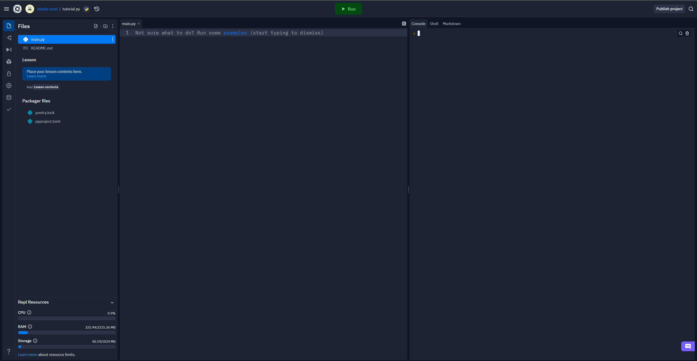
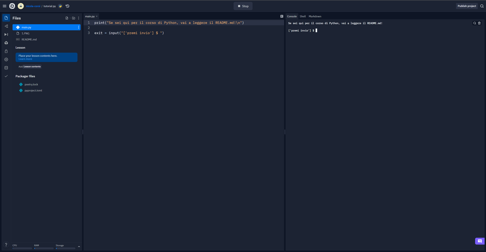

# Imparare Python (ITA)
## Nicola Adami

### indice:

1. [Introduzione a Python](#1)

*livello 1*

2. [Output](#2)
3. [Variabili - Cosa sono](#3)
4. [Variabili - Tipi di dati](#4)
5. [Numeri](#5)
6. [Stringhe](#6)
7. [Valori Booleani](#7)
8. [Operatori Logici](#8)
9. [Liste](#9)
10. [Dizionari](#10)
11. [Condizioni](#11)
12. [Cicli](#12)
13. [Input Utente](#13)

*livello 2*

14. [Funzioni](#14)
15. [Lambda](#15)
16. [Classi](#16)
17. [Moduli](#17)
18. [Try - Except](#18)
19. [JSON](#19)
20. [PIP](#20)

<a name="1"></a>

### 1. introduzione a Python

Python è un linguaggio di programmazione ad alto livello, cioè l'umano riesce più o meno a comprendere cosa c'è scritto. E' molto utilizzato nel mondo e, spesso, è tra i linguaggi più utilizzati dell'anno (come nel 2022 ad esempio). Può essere utilizzato per diversi scopi:
<table>
	<tr>
		<td>
			<ul>
				<li>Data Science</li>
			</ul>
		</td>
		<td>
			Utilizzato per fare calcoli matematici complessi, algebra e geometria
		</td>
	</tr>
	<tr>
		<td>
			<ul>
				<li>Intelligenza Artificiale</li>
			</ul>
		</td>
		<td>
			Utilizzato nell'intelligenza artificiale, come robot
		</td>
	</tr>
	<tr>
		<td>
			<ul>
				<li>Applicazioni Web</li>
			</ul>
		</td>
		<td>
			Utilizzato (con la libreria Django) per creare applicativi Web
		</td>
	</tr>
	<tr>
		<td>
			<ul>
				<li>Software PC</li>
			</ul>
		</td>
		<td>
			Utilizzato per creare software (app) per PC, MacOS e Linux
		</td>
	</tr>
	<tr>
		<td>
			<ul>
				<li>Applicazioni Smartphone</li>
			</ul>
		</td>
		<td>
			Utilizzato per creare applicazioni per Android e iOS
		</td>
	</tr>
</table>
Per questo viene utlizzato in molte aziende e da privati.

<a name="2"></a>

### 2. Output

Iniziamo a creare il nostro progetto in Python. andiamo su [replit](https://replit.com/), creiamo un'account e creiamo un nuovo progetto, il file deve finire con *.py* che è l'estensione per python. Solitamente il nome del file principale è main.py (in italiano principale.python).

Aprendolo vedremo questa schermata:

quindi sapremo che stiamo lavorando nel file giusto.

Si scrive qui:


a sinistra c'è il codice che noi scriveremo, a destra sarà la console del programma, quindi quello che ci sarà in output.

Più si va giù con le righe più il programma va avanti, come un tema in inglese, seguendo un'istruzione dopo l'altra: un esempio veloce potrebbe essere:

<ol>
	<li>Prendo il toast</li>
	<li>Lo inserisco nel tostapane</li>
	<li>Aspetto che si scaldi</li>
	<li>Lo farcisco con il prosciutto</li>
	<li>Lo mangio</li>
</ol>

Iniziamo a scrivere questo:
```python
# Questo è un commento, una parte scritta da te che non viene letta nel codice, serve per scrivere cose per se oppure spiegare qualcosa nel codice
print("Ciao!") # print (In italiano stampa) scrive a schermo quello che noi scriveremo tra le virgolette
```
ora clicchiamo in alto al centro *run* e sulla console inizierà a eseguire il programma!

Questo è un'output quindi un flusso di uscita, tutto quello che viene eseguito da print verrà scritto a schermo.

<a name="3"></a>

### 3. Variabili - Cosa sono

Le variabili sono dei contenitori di dati, c'è ne possono essere di tipi diversi:
<ul>
	<li>Int: Numero intero (10)</li>
	<li>Float: Numero decimale (3.14)</li>
	<li>String: Stringa di testo ("Ciao a tutti!")</li>
	<li>Char: Una sola lettera ('a' oppure 'A')</li>
	<li>Booleano: E' un valore che può essere o vero (True) o falso (False), lo vedremo meglio dopo</li>
</ul>

```python
numero = 10 # Così è come si dichiara una variabile. Significa: creo una variabile chiamata numero, che è una scatola, che contiene il numero 10
pi_greco = 3.14 # Le variabili non possono avere nomi staccati, ma si possono staccare con il trattino basso _ o mettendo la lettera in maiuscolo piGreco, questo è di tipo float
stringa = "Ciao a tutti!" # Le strighe si mettono SEMPRE tra virgolette ""
lettera = 'a' # I char SEMPRE con i singoli apici '', a non è A
vero_o_falso = True # Questo è un valore booleano, cioè o vero o falso

numero2 = int(14) # Come prima cosa, i nomi delle variabili non possono essere uguali al altri già esistenti (in questo caso numero), per specificare che quella variabile è di tipo intero basta scrivere il tipo (in questo caso int) e tra parentesi il contenuto

global essere_online = False # Questa variabile è un po' particolare, si chiama variabile globale, perchè può essere presa dovunque nel programma, come vedremo dopo nelle funzioni esterne
```
Si possono scrivere in diversi modi (I nomi non possono essere uguali uno all'altro):

```python
# Quelli che vanno bene
numero = 16
Numero = 16
numero_1 = 16
numero_Numero = 16
Numero_Numero = 16
_numero = 16

# Quelli che NON vanno bene
1numero = 16
numero-1 = 16
numero 1 = 16
```

Ora vediamo come utilizzarle (cancelliamo pure print("Ciao!") ):

<a name="4"></a>

### 4. Variabili - Tipi di dati

iniziamo scrivendo 2 variabili di tipo stringa e 1 di tipo intero: nome, cognome, anno di nascita; poi le manderemo a schermo

```python
nome = "Nicola"
cognome = "Adami"
annoNascita = 2006
```
Perfetto! Ora ci scriviamo le variabili in output:
```python
nome = "Nicola"
cognome = "Adami"
annoNascita = 2006

print("Nome:", nome) # Oltre a mandare in output quello che vogliamo scrivere, si può mandare anche numeri print(3), booleani print(True), variabili (nome), ma anche un insieme, ad esempio qui uscirà: Nome: Nicola
print("Cognome:",cognome,"\nAnno di nascita:", annoNascita) # Come si può vedere, \n serve per mandare a capo, creando così una nuova linea (puoi cliccare ogni volta che vuoi run, in modo da vedere se funziona il programma o no)
```

<a name="5"></a>

### 5. Numeri
Ora parleremo di matematica, lavoreremo con i numeri.
I numeri possono essere positivi (133) e negativi (-475)
Avevamo detto che col print si può scrivere tutto quindi perchè non fargli fare funzioni matematiche? Si, si può fare.
```python
print("Valore di uscita in output:", 3*3) # In output uscirà: Valore di uscita in output: 9, perchè fa 3 per 3, che è 9
```
Ora vediamo che si può fare la stessa cosa con le variabili:
```python
numero1 = 3
print("Valore di uscita in output:", 3*numero1) # Il risultato sarà comunque 9, perchè scriverà 3 per 3, che è il valore di numero1.
print("Valore di uscita in output:", numero1*numero1+1) # Uscirà 10 in questo caso, perchè fa (3*3)+1.
```
Ordine gerarchico (è come nella nostra matematica):
1. {} = vengono per prime
2. [] = vengono per seconde
3. () = vengono per terze

Operatori matematici:
1. \+ = addizione ( + )
2. \- = sottrazione ( - )
3. \* = moltiplicazione ( x )
4. / = divisione ( : )

<a name="6"></a>

### 6. Stringhe
Lavorare con le stringhe può essere semplice o complesso. Ci sono 2 tipi per dichiarare una stringa:
```python
stringa_1 = "Ciao sono Nicola" # Su linea singola
stringa_2 = '''
Ciao
sono
Nicola
''' # Su linea multipla
```
Alcune cose utili:
```python
testo = string("Ciao sono una stringa")

# Leggere solo una lettera

print(testo[0]) # Leggerà la prima lettera della stringa (i numeri partono SEMPRE dallo 0), in questo caso scriverà 'C'

# Leggere la lunghezza della stringa

print(len(testo)) # len in italiano è lunghezza, quindi scriverà in numero la lunghezza di stringa. Ricordo che parte SEMPRE da 0

# Cercare una parola o lettera nella stringa

print("una" in testo) # Cercherà la parola 'una' nella stringa

# Scrivere solo una parte di stringa

print(testo[0:3]) # Scriverà solo Ciao, perchè legge dal carattere 0 al 3

# Rendere tutto maiuscolo o minuscolo

print(testo.upper) # Upper sta per maiuscolo

print(testo.lower) # Lower sta per minuscolo

# Sostituisce una lettera

print(testo.replace("C", "X")) # Scriverà Xiao sono una stringa

# Collegare 2 stringhe

x = "Nicola"
y = "Adami"
z = x + " " + y
print(z) # Scriverà Nicola Adami (c'è anche lo spazio " " tra le 2 parole)
```
<a name="7"></a>

### 7. Valori Booleani
I valori booleani possono essere o veri o falsi. Non c'è la via di mezzo. Vengono usati ad esempio nei cicli, o a dichiarare una variabile per sapere se quella persona è online oppure no, ad esempio in una chat.

Si dichiarano così:
```python
vero = True # Booleano 1 (acceso oppure vero)
falso = False # Booleano 0 (spento oppure false)

online = bool(True) # Questo è come si dichiara con il valore specificato
```

<a name="8"></a>

### 8. Operatori Logici
Gli operatori logici sono degli operatori utilizzati nelle condizioni e cicli, e sono questi: *And, Or, Not*.

#### AND
<table>
	<thead>
		<tr>
			<th>VALORE 1</th>
			<th>VALORE 2</th>
			<th>RISULTATO</th>
		</tr>
		<tr>
			<th>1</th>
			<th>0</th>
			<th>0 (se c'è un 1 e uno 0 il risultato sarà 0 perché non sono uguali)</th>
		</tr>
	</thead>
</table>

#### OR
<table>
	<thead>
		<tr>
			<th>VALORE 1</th>
			<th>VALORE 2</th>
			<th>RISULTATO</th>
		</tr>
		<tr>
			<th>1</th>
			<th>0</th>
			<th>1 (se c'è un 1 e uno 0 il risultato sarà 1 perché o un o l'altro sono 1)</th>
		</tr>
	</thead>
</table>

#### NOT
<table>
	<thead>
		<tr>
			<th>VALORE 1</th>
			<th>VALORE 2</th>
			<th>RISULTATO</th>
		</tr>
		<tr>
			<th>1</th>
			<th>0</th>
			<th>0 (se c'è un 1 e uno 0 il risultato sarà 0 perché nessuno prevale)</th>
		</tr>
	</thead>
</table>

Poi li capirete meglio nei cicli.

Ci sono anche degli operatori che tutti conoscete:

< --> maggiore di...

\> --> minore di...

== --> uguale a...

<= --> maggiore o uguale a...

\>= --> minore o uguale a...

<a name="9"></a>

### 9. Liste

Le liste sono interessanti. Possono contenere varie variabili o dati, hanno un alunghezza praticamente infinita. Vediamole:

```python
lista = [3, 6, 9, -12] # Le liste DEVONO contenere solo un tipo di dato, quindi i suoi dati all'interno devono essere tutti dello stesso tipo (in questo caso il tipo è intero)

a = 1
b = 2

lista2 = [a, b, 4] # Ci possono essere delle variabili al suo interno, a patto che siano dello stesso tipo
```
Ora vediamo cosa possiamo farci:
```python
lista = ["banana", "mela", "pera", "albicocca"]

print(len(lista)) # Lo avevamo già visto in precedenza, serve a leggere la lunghezza della lista, in questo caso darà 4 perchè è la lunghezza delle parole che la compongono, non i caratteri

print(lista[0]) # Leggerà la prima parola della lista

print(lista[1-3]) # Leggerà dalla seconda alla quarta parola "mela", "pera", "albicocca"

lista[0] = "kiwi" # Mette al posto di banana (che è al posto 0) la parola "kiwi"

lista.insert(1, "kiwi") # Inserisce al posto 1 (dopo banana) la parola kiwi, senza cambiare altre parole: "banana", "kiwi", "mela", "pera", "albicocca"

lista.remove("kiwi") # Eliminerà dalla lista kiwi

lista2 = [3.14, 3.19, -133.2, 1556.122] # Lista di float

lista2.sort() # Ordina in numero crescente la lista (o nel caso di una lista stringa in ordine alfabetico)
```
<a name="10"></a>

### 10. Dizionari
I dizionari vengono utilizzati per memorizzare i valori dei dati nelle coppie chiave: valore.

I dizionari sono scritti tra parentesi graffe e hanno chiavi e valori (chiavi è tipo nome e valori è tipo Nicola):

```python
persona1 = { # Questo è un esempio di dizionario, che in questo caso definisce la persona 1
	"Nome": "Nicola",
	"Cognome": "Adami",
	"Laureato": False,
	"Anni": 16
}
```
Per modifiche, aggiunte o riminozioni è uguale alle liste:
```python
persona1 = {
	"Nome": "Nicola",
	"Anni": 16
}
persona1.update({"Laureato": False}) # Aggiunge in fondo laureato = false
persona1.pop("Laureato") # Elimina l'elemento Laureato (quindi anche la sua chiave)
```
Si possono creare (annidare) più dizionari in uno:
```python
classe = {
	"Persona1" : {
		"Nome": "Nicola",
		"Anni": 16
	},
	"Persona2" : {
		"Nome": "Paolo",
		"Anni": 15
	},
	"Persona3" : {
		"Nome": "Mario",
		"Anni": 17
	}
}
```
<a name="11"></a>

### 11. Condizioni

Le condizioni sono MOLTO utili nella programmazione. servono a far 'pensare' al programma:

*Se a è maggiore di b? Cosa faccio?*

Ora lo vediamo:

```python
a = 30
b = 10

if a > b: # Se a è maggiore di b?
	print("A è maggiore di B!") # Scrive A è maggiore di B!
else: # altrimenti:
	print("A è minore di B!") # Scrive A è minore di B!
```
Con questa logica ci puoi fare un sacco di cose:
```python
a = 10, b = 5, x = "ciao", y = "ciao" # Si possono dichiarare più variabili assieme (sulla stessa riga) così

if a > b and x == y: # questa condizione lo farà SOLO se A è maggiore di B E (and) X è uguale a Y
	print("Tutte e due sono vere")
elif a > b: # Elif è correlato all'if sopra di lui e dice se a è maggiore di b? (Può essere che a valga di meno di b quindi non per forza a deve essere maggiore di b)
	print("Solo la prima condizione è vera") # Scrive questo
elif x == y: # Ma se SOLO x è maggiore di y?
	print("Solo la seconda condizione è vera") # Scrive questo
else: # Se tutte le condizioni prima non sono vere (quindi a è minore di b, ma anche x è diversa da y)
	print("nessuna condizione è vera") # Scrive questo
```
<a name="12"></a>

### 12. Cicli

Anche i cicli sono fondamentali nella programmazione:

un ciclo while è un ciclo che consente l'esecuzione ripetuta del codice in base a una determinata condizione.

#### While = Mentre

```python
i = 0

while i < 10: # Nel momento in cui i è minore di 10
	print("Valore di i:", i) # Scrive Valore di i: 1 (ad esempio)
```
Il codice verrà ripetuto ogni volta finché i non è minore di 10 (e in questo caso parte da 0 code dichiarato prima dalla variabile).

Si può bloccare il ciclo in un determinato punto

```python
i = 0

while i < 10: # ripete finchè i non è minore di 10
	print("Valore di i:", i) # E ogni volta scrive questo
	if i == 4: # Ma se i è arrivato a 4
		break # Il ciclo si blocca con break
```

per farlo continuare all' infinito:

```python
while True: # Finchè è verò (cioè per sempre)
	print("Ciao!")
```

#### For = Per

Il ciclo for è una struttura che determina un'esecuzione ripetuta per un certo numero di volte. Si può dire che è un while ma che sa quante volte essere ripetuto.

In python viene utiizzato solitamente per scrivere array, liste, o dizionari

```python
lista = ["banana", "mela", "pera", "albicocca"]

for x in lista: # Cerca nella lista (quindi scriverà ogni parola in ordine) con una variabile x
	print(x) # Quindi non scrive lista ma x per scrvere a capo ogni elemento della lista
	if x in "mela": # Se x trova mela
		break # Si blocca il ciclo

for x in range(10): # per x nell' "intervallo" di 10 (quindi ripete per 10 volte)
	print(x) # Scrive x
```

<a name="13"></a>

### 13. Input Utente

L' input è una cosa che scrivi, quindi un qualcosa che ti chiede il programma.

```python
numero = int(input("inserisci un numero compreso tra 1 e 10: ")) # crea una variabile chiamata numero che chiede di inserire un numero (int) quindi un input (input) e scrive questo per farti capire cosa inserire. Ricordati che dopo avwer inserito il numero devi andare a capo premento 'invio'

# Quindi ora ci puoi lavorare come una variabile:

if numero >= 0 and numero <= 5:
	print("Sei bocciato!")
elif numero >= 6 and numero <= 10:
	print("Sei promosso!")
else:
	print("Il numero non è compreso tra quello che ti avevo chiesto")
```

<a name="14"></a>

### 14. Funzioni

Una funzione è un blocco di codice che viene eseguito solo quando viene chiamata, è possibile passare dati, chiamati parametri, in una funzione.

Una funzione può restituire dati come risultato.

```python
def funzione_esterna(): # Qui definisce (def) la funzione chiamata funzione_esterna sempre seguita dalle parentesi()
	nome = str(input("Inserisci il tuo nome: "))
	print("Ciao," nome) # All'interno ci scriviamo ciao, nome che hai inserito

# Ma ora non si vedrà nulla sullo schermo perchè bisogna chiamarla

funzione_esterna() # Così la si chiama
```

<a name="15"></a>

### 15. Lambda

Una funzione lambda è una piccola funzione anonima, può accettare un numero qualsiasi di argomenti, ma può avere solo un'espressione.

lambda argomento : espressione

```python
x = lambda a : a + 10 # Traduciamolo: x è una funzione lambda che contiene a che è x + 10
print(x(5)) # x Vale 5 da ora quindi farà x = lambda a : 5 + 10, risultato: 15

x = lambda a, b : a * b # Qui gli input sono 2: a e b, il risultato è a per b
print(x(5, 6)) # A vale 5 e b 6
```

<a name="16"></a>

### 16. Classi

Una classe è come un progetto per la creazione di oggetti. Ora lo vediamo:

```python
class persone: # Crea una classe chiamata persone...
	def __init__(self, nome, eta): # Questa classe contiene (contiene = __init__): self (che è un costruttore), nome ed età
		self.nome = nome # Il nome di self (che è come se fosse "persone") è nome in generale
		self.eta = eta # Stessa cosa per l'età

persona1 = persone() # Qui creiamo un oggetto, quindi una persona

persona1.nome = "Nicola" # Gli diamo il nome ala persona 1, cioè Nicola
persona1.eta = 16 # E gli diamo l'età
```

<a name="17"></a>

### 17. Moduli

I moduli sono un'estensione del programma, permettono di fare più cose in un programma.

Ad esempio creare un'interfaccia grafica (gui), leggere il giorno corrente, creare un timer, creare un videogioco!! e cose di questo tipo.

I moduli si mettono sempre all'inizio del programma.

#### Sono strutturati così:

import time è la libreria (solo time, import significa che importa);

time.sleep(3) prende dalla libreria time la funzione sleep quindi time.sleep e tra parentesi quello che viene dopo, quindi 3 secondi di blocco del codice

```python
import time # Importa la libreria che gestisce il tempo
import datetime # Importa la libreria che gestisce le date

def countdown(h, m, s): # Definisce la funzione countdown che ha al suo interno ore, minuti e secondi
    totale = h * 3600 + m * 60 + s # Questa variabile crea il tempo che crea le ore, i minuti e i secondi
    
    while totale > 0: # Mentre il tempo è maggiore di 0...
        timer = datetime.timedelta(seconds = totale) # Qui prende una funzione dalla libreria datetime che dice che i secondi sono uguali alla variabile totale
        print(timer, end="\r") # Scrive i secondi
        time.sleep(1) # Fa attendere 1 secondo ogni volta
        totale -= 1 # Diminuisce il tempo di 1
    print("Il tempo è scaduto!") # Quando finisce il tempo scrive. Il tempo è scaduto!

ore = int(input("Inserisci le ore: ")) # Questi sono degli input per sapere di quanto tempo deve il timer
minuti = int(input("Inserisci i minuti: "))
secondi = int(input("Inserisci i secondi: "))

countdown(ore, minuti, secondi) # Qui richiama la funzione countdown
```
ora faccimo un giochino per indovinare il numero casuale:
```python
import random

numero_casuale = random.randint(0, 10) # Genera un numero casuale tra 0 e 10 con la libreria random

vite = 3 # Qui decidiamo il numero delle vite

while vite > 0: # Mentre le vite sono maggiori di 0:
    print("\n\nVITE:", vite) # Scrive vite: [numero di vite], \n sta per newline, quindi va a capo di una linea
    
    numero = int(input("Indovina il numero casuale: ")) # Qui chiede il numero casuale
    
    if numero == numero_casuale: # Se il numero che scrivete è uguale al numero casuale
        print("Hai vinto! Il numero era", numero_casuale) # Scriverà vittoria
		break # E bloccherà il programma
    elif numero != numero_casuale: # Se il numero è diverso dal numero casuale (!= sta per diverso da)
        print("Hai sbagliato!") # Scriverà hai sbagliato
        vite -= 1 # E diminuirà di 1 vita ogni volta
    
    if vite == 0: # Se le vite arrivano a 0
        print("Hai finito le vite! Il numero era", numero_casuale) # Scriverà che avete perso
        break # E bloccherà il programma
```

<a name="18"></a>

### 18. Try - Except

Try consente di verificare la presenza di errori in un blocco di codice,

Except blocco ti consente di gestire l'errore.

Ad esempio:

```python
# Non definiamo X

try: # Prova a vedere se in questo caso trova x
	print("Valore di x:", x) # Se esiste x scrive valore di x: 3 (ad esempio)
except: # Se sopra non è vero
	print("X non trovata") # Scrive che X non è stata trovata
```
#### Perchè devo utilizzarlo?

Se ad esempio dovessimo creare un programma che scarichi un programma sul nostro pc potrebbe vedere (con la libreria os) se il programma è già stato installato altrimenti lo scarica

```python
nome_programma = "Programma A Caso da Installare"

try:
	# Cerca se esiste il programma
except:
	# Installa tutti i pacchetti per scaricare il programma
finally:
	print("Ho finito di scaricare", nome_programma)
```

Finally consente alla fine di tutto il processo prima di fare qualcosa, è un blocco che aspetta che termini il try-except per essere eseguito.

<a name="19"></a>

### 19. JSON

[JSON](https://www.json.org/json-it.html) è una sintassi per l'archiviazione e lo scambio di dati, è un testo scritto con JavaScript (è il linguaggio per programmare le pagine web).

```python
# Se si vuole creare un json all'interno del programma
import json

file_json = '{"Nome": "Nicola", "Eta": 30, "Laureato": false}' # Crea una variabile normale di tipo stringa (strutturata però come un json)

file_finito = json.loads(file_json) # Crea una variabile che converte la stringa in un json

print(file_finito["Nome"]) # Prende dal file finito (che ormai è un json) la variabile nome, che in output darà Nicola.

print(file_finito) # Scrive tutto il json e non solo il nome
```
Sono mimili ai dict (dizionari di python) vero?

In effetti puoi convertire anche quelli in json! Vediamo come:

```python
json_finto = {
	"frutto1": "mela",
	"frutto2": "banana",
	"frutto3": "kiwi"
}

json_vero = json.dump(json_finto) # Crea un json dal dizionario

print(json_vero) # Scrive il json appena creato
```

Se notate esce un po' brutto su una riga! Facciamo così:

```python
json_init = {
	"frutto1": "mela",
	"frutto2": "banana",
	"frutto3": "kiwi"
}

out = json.dump(json_init, indent=4) # Indenta di 4 spazi, cioè a ogni riga automaticamente gli crea 4 spazi come se avessimo scritto un json vero

print(out)
```

<a name="20"></a>

### 20. PIP

PIP è un gestore di pacchetti. Permette di scaricare più librerie da utilizzare, ad esempio ursula o pygame per i videogiochi, pyinstall per convertire il tuo progetto python in un exe ecc.

#### PER REPLIT

per scaricare il pip basta andare in alto a destra (dove c'è scritto console e shell per intenderci) e cliccare shell. Da qui scrivere:

```bash
pip --version
```

Se non esce alcuna versione scrivere:

```bash
sudo apt istall pip
```

Ora basta che scriviamo:

```bash
pip install <nome libreria
```

per installare ogni libreria che esista in python.

Ad esempio:

```python
pip install pygame # per installare pygame
```

## Conclusioni
Con questo abbiamo questo corso introduttivo a Python, spero ti sia stato utile!

## *Nicola Adami - Copyright © 2022*
